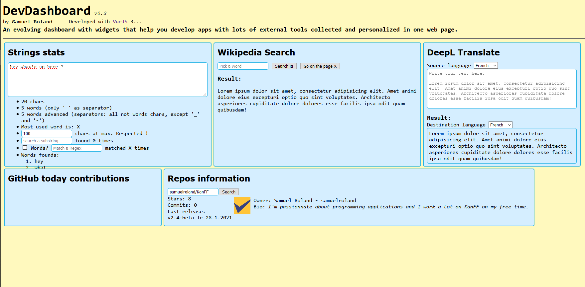

# DevDashboard

### A dashboard for developers centralizing and customizing small tools complementary to development.

`Current design and widgets`

**DISCLAIMER**: The development of this app is in progress. Use it at your own risk! The authors decline all responsibility. The app is not ready to be used (ready starting version 1.0 on `main` branch).

## How to use
The app is built to be run locally on the dev machine, where tokens and other config are stored locally too. The app installation and configuration is not user-friendly but it's not a problem because it's built for developers.
1. Clone the repos or download the latest version under [releases](https://github.com/samuelroland/DevDashboard/releases)
1. ...

## Technical description
DevDashboard is a simple `index.html` with **VueJS 3** and **Tailwindcss**. Each tool is called a *widget*.

## How to configure
TBD

## Contributions
Currently, the new widgets are added by me depending on my motivation and the available time. If you're interested to contribute or share an idea (new widget, enhancements on existings widgets, feedbacks, new widget request, ...), **feel free to open an issue** to start a discussion.

## About
The personal goal of this app to learn VueJS 3 and Tailwindcss, and have a tools that centralize little utilities for development that avoid me to open lots of browser tabs with DeepL, Wikipedia, GitHub, Larousse, ...

## French Translation (traduction française):
### Un tableau de bord pour développeurs centralisant et personnalisant des petits outils complémentaires au développement.

**AVERTISSEMENT**: Le développement de cette application est en cours. Utilisez-là à vos propres risques. Les auteur·ices déclinent toute responsabilité. L'application n'est pas prête à être utilisée (prête à partir de la version 1.0 sur la branche `main`).

## Comment utiliser
L'application est conçue pour être lancée localement sur la machine de développement, où les tokens et configurations sont stockées localement aussi. L'application et l'installation de l'application pas convivial, mais ce n'est pas un problème car elle est conçue pour les développeur·euses.
1. Clonez le repos ou téléchargez la dernière version sous [Publications](https://github.com/samuelroland/DevDashboard/releases)
1. ...

## Description technique
DevDashboard est une simple fichier `index.html` avec **VueJS 3** et **Tailwindcss**. Chaque outil est appelé un *widget*.

## Comment configurer
TBD

## Contributions
Actuellment, les nouveaux widgets sont ajotuées selon ma motivation et mon temps disponibilités. Si vous êtes intéressé·e à contribuer ou partager une idée (nouveau widget, améliorations sur des widgets existants, des retours, une demande de nouveau widget, ...), **n'hésitez pas à ouvrir une issue** pour commencer une discussion.

## A propos
L'objectif personnel de cette application est d'apprendre VueJS 3 et Tailwindcss, et d'avoir un touils qui centralise des petits utilitaires qui m'évitent d'ouvrir beaucoup d'onglets de navigateurs avec DeepL, Wikipedia, GitHub, Larousse, ...
